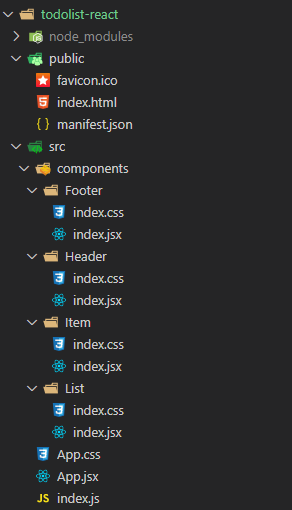

# React TodoList

React TodoList 組件練習

# todoList思路分析

1. 拆分組件、實現靜態組件，注意className、Style的寫法
2. 動態初始化列表，如何確定將數據放在哪個組件的state中?
    - 某個組件使用： 放在自身的state中
    - 某些組件使用： 放在他們共同的父組件state中(官方稱此操作為：動態提升)
3. 關於父子之間通信
    - 父組件給子組件傳遞數據：通過props傳遞
    - 子組件給父組傳傳遞數據：通過props傳遞，要求父提前給子傳遞一個函數
4. 注意defaultChecked和checked的區別，類似的還有：defaultValue和value
5. 狀態在哪裡，操作狀態的方法就在哪裡    
# 創建項目

若沒安裝過的話，需先全局安裝

```bash
npm i -g create-react-app
```


創建項目(項目名稱需小寫)，這邊要等一小段時間

```bash
create-react-app todolist-react
```


啟動項目

```bash
cd todolist-react
npm start
```


# 簡化框架原始結構


刪除不需要的檔案，只留下基本的，需要刪除多應的代碼


# 安裝插件


# 安裝生成uuid模塊


```bash
npm i nanoid
```


引用

```js
import {nanoid} from 'nanoid'
```

測試

```js
console.log(nanoid());
console.log(nanoid());
console.log(nanoid());
```


# PropTypes

可以對傳入的props的型態作限制

安裝

```js
npm i prop-types
```


引入

```js
import PropTypes from 'prop-types'
```

對傳入的參數作限制

```js
// 對接收的props進行: 類型、必要性的限制
static propTypes={
    addTodo:PropTypes.func.isRequired
}
```
# 執行畫面


# 代碼結構



# 源代碼

## App

App.jsx
```jsx
import React, { Component } from 'react'

import {nanoid} from 'nanoid'
import Header from './components/Header'
import Footer from './components/Footer';
import List from './components/List';
import './App.css';

export default class App extends Component {
  // 狀態在哪裡，操作狀態的方法就在哪裡

  // 初始化狀態
  state = {
    todos:[
      {id:nanoid(),name:'吃飯',done:true},
      {id:nanoid(),name:'睡覺',done:true},
      {id:nanoid(),name:'打代碼',done:false},
      {id:nanoid(),name:'逛街',done:false},
    ]
  }

  // addTodo用於添加一個todo，接收的參數是todo對象
  addTodo = (todoObj)=>{
    // 獲取原todos
    const {todos} = this.state;

    // 追加一個todo
    const newTodos = [todoObj,...todos];

    // 更新狀態
    this.setState({todos:newTodos});
  }

  // updateTodo用於更新一個todo對象
  updateTodo = (id,done)=>{
    // 獲取狀態中的todos
    const {todos} = this.state;

    // 匹配處理數據
    const newTodos = todos.map((todoObj)=>{
      // 判斷id是自己的話，則更新done的值
      if(todoObj.id === id) return{...todoObj,done}
      else return todoObj
    })

    this.setState({todos:newTodos})
  }

  // deleteTodo用於刪除一個todo對象
  deleteTodo = (id)=>{
    const {todos} = this.state;

    // 獲取指定id的todo對象
    const newTodos = todos.filter((todoObj)=>{
      return todoObj.id !== id
    })

    // 更新狀態
    this.setState({todos:newTodos});
  }

  // checkAllTodo用於全選
  checkAllTodo = (done)=>{
    // 獲取原來的todos
    const {todos} = this.state;

    // 加工數據
    const newTodos = todos.map((todoObj)=>{
      return {...todoObj,done}
    })

    // 更新狀態
    this.setState({todos:newTodos});
  }

  // clearAll用於清除所有已完成的
  clearAllDone = ()=>{
    // 獲取原來的todos
    const {todos}  = this.state;

    // 過濾數據
    const newTodos = todos.filter((todoObj)=>{
        return !todoObj.done;
    });

    // 更新狀態
    this.setState({todos:newTodos});
  }

  render() {

    const {todos} = this.state

    return (
      <div className="App" >
        <div className="todo-container">
          <div className="todo-wrap">
            <Header addTodo={this.addTodo}/>
            <List todos={todos} updateTodo={this.updateTodo} deleteTodo={this.deleteTodo} />
            <Footer todos={todos} checkAllTodo={this.checkAllTodo} clearAllDone={this.clearAllDone} />
          </div>
        </div>
      </div>
    );
  }
}

//export default App;

```

App.css
```css
/*base*/
body {
    background: #fff;
  }
  
  .btn {
    display: inline-block;
    padding: 4px 12px;
    margin-bottom: 0;
    font-size: 14px;
    line-height: 20px;
    text-align: center;
    vertical-align: middle;
    cursor: pointer;
    box-shadow: inset 0 1px 0 rgba(255, 255, 255, 0.2), 0 1px 2px rgba(0, 0, 0, 0.05);
    border-radius: 4px;
  }
  
  .btn-danger {
    color: #fff;
    background-color: #da4f49;
    border: 1px solid #bd362f;
  }
  
  .btn-danger:hover {
    color: #fff;
    background-color: #bd362f;
  }
  
  .btn:focus {
    outline: none;
  }
  
  .todo-container {
    width: 600px;
    margin: 0 auto;
  }
  .todo-container .todo-wrap {
    padding: 10px;
    border: 1px solid #ddd;
    border-radius: 5px;
  }
  
```

## Header

Header/index.jsx
```jsx
import React, { Component } from 'react'
import PropTypes from 'prop-types'
import {nanoid} from 'nanoid'
import './index.css'

export default class Header extends Component {

    // 對接收的props進行: 類型、必要性的限制
    static propTypes={
        addTodo:PropTypes.func.isRequired
    }

    // 鍵盤事件的回調
    handleKeyUp = (event)=>{
        const {keyCode,target} = event;

        // 判斷是否為Enter按鍵
        if(keyCode !== 13) return;

        // 添加的todo名字不能為空
        if(target.value.trim() === ''){
            alert('輸入不能為空');
        }

        // 打印所按的值、按鍵的值
        console.log(target.value, keyCode);

        // 準備好一個todo對象
        const todoObj = {id:nanoid(),name:target.value,done:false};
        console.log(todoObj);

        // 將todoObj傳遞給App
        this.props.addTodo(todoObj);
    }

    render() {
        return (
            <div className="todo-header">
                <input onKeyUp={this.handleKeyUp} type="text" placeholder="请输入你的任务名称，按回车键确认" />
            </div>
        )
    }
}

```

Header/index.css
```css
 /*header*/
 .todo-header input {
    width: 560px;
    height: 28px;
    font-size: 14px;
    border: 1px solid #ccc;
    border-radius: 4px;
    padding: 4px 7px;
  }
  
  .todo-header input:focus {
    outline: none;
    border-color: rgba(82, 168, 236, 0.8);
    box-shadow: inset 0 1px 1px rgba(0, 0, 0, 0.075), 0 0 8px rgba(82, 168, 236, 0.6);
  }
```

## List

List/index.jsx
```jsx
import React, { Component } from 'react'
import PropTypes from 'prop-types'
import Item from '../Item'
import './index.css'

export default class List extends Component {

    // 對接收的props進行: 類型、必要性的限制
    static propTypes={
        addTodo:PropTypes.array,
        updateTodo:PropTypes.func.isRequired,
        deleteTodo:PropTypes.func.isRequired
    }

    render() {
        
        const {todos,updateTodo,deleteTodo} = this.props

        return (
            <ul className="todo-main">
                {
                    todos.map((todo)=>{
                        // 每個child要有一個key
                        return <Item key={todo.id} {...todo} updateTodo={updateTodo}  deleteTodo={deleteTodo} />
                    })
                }
            </ul>
        )
    }
}

```

List/index.css
```css
 /*main*/
 .todo-main {
    margin-left: 0px;
    border: 1px solid #ddd;
    border-radius: 2px;
    padding: 0px;
  }
  
  .todo-empty {
    height: 40px;
    line-height: 40px;
    border: 1px solid #ddd;
    border-radius: 2px;
    padding-left: 5px;
    margin-top: 10px;
  }
```

## Item

Item/index.jsx
```jsx
import React, { Component } from 'react'
import './index.css'

export default class Item extends Component {

    state = {mouse:false};

    // 鼠標移入、移出的回調
    handleMouse = (flag) =>{
        return ()=>{
            console.log(flag);
            this.setState({mouse:flag});
        }
    }

    // 勾選、取消勾選某一個todo的回調
    handleCheck = (id)=>{
        return (event)=>{
            console.log(id,event.target.checked);
            this.props.updateTodo(id,event.target.checked);
        }
    }

    // 刪除一個todo的回調
    handleDelete = (id)=>{
        if(window.confirm('確定刪除嗎?')){
            this.props.deleteTodo(id);
        }
    }

    render() {
        const {id,name,done} = this.props;
        const {mouse} = this.state;

        return (
            <li style={{backgroundColor:mouse ? '#ddd':'white'}} onMouseEnter={this.handleMouse(true)} onMouseLeave={this.handleMouse(false)} >
                <label>
                    <input type="checkbox" checked={done} onChange={this.handleCheck(id)} />
                    <span>{name}</span>
                </label>
                <button onClick={()=>{this.handleDelete(id)}} className="btn btn-danger" style={{ display:mouse?'block':'none' }}>删除</button>
            </li>
        )
    }
}

```

Item/index.css
```css
/*item*/
li {
    list-style: none;
    height: 36px;
    line-height: 36px;
    padding: 0 5px;
    border-bottom: 1px solid #ddd;
  }
  
  li label {
    float: left;
    cursor: pointer;
  }
  
  li label li input {
    vertical-align: middle;
    margin-right: 6px;
    position: relative;
    top: -1px;
  }
  
  li button {
    float: right;
    display: none;
    margin-top: 3px;
  }
  
  li:before {
    content: initial;
  }
  
  li:last-child {
    border-bottom: none;
  }
```

## Footer

Footer/index.jsx
```jsx
import React, { Component } from 'react'
import './index.css'

export default class Footer extends Component {

    // 全選checkbox的回調
    handleCheckAll = (event)=>{
        this.props.checkAllTodo(event.target.checked);
    }

    // 清除已完成任務的回調
    handleClearAllDone = ()=>{
        this.props.clearAllDone();
    }

    render() {
        const {todos} = this.props;

        // 已完成的個數
        //const doneCount = todos.reduce((pre,todo)=>{return pre+(todo.done?1:0)},0);
        const doneCount = todos.reduce((pre, todo) => pre + (todo.done ? 1 : 0), 0);
        console.log('@@@', doneCount);

        // 總數
        const total = todos.length;

        return (
            <div className="todo-footer">
                <label>
                    <input type="checkbox" onChange={this.handleCheckAll} checked={doneCount === total && total !== 0 ? true:false} />
                </label>
                <span>
                    <span>已完成{doneCount}</span> / 全部{total}
            </span>
                <button onClick={this.handleClearAllDone} className="btn btn-danger">清除已完成任务</button>
            </div>
        )
    }
}

```

Footer/index.css
```css
/*footer*/
.todo-footer {
    height: 40px;
    line-height: 40px;
    padding-left: 6px;
    margin-top: 5px;
  }
  
  .todo-footer label {
    display: inline-block;
    margin-right: 20px;
    cursor: pointer;
  }
  
  .todo-footer label input {
    position: relative;
    top: -1px;
    vertical-align: middle;
    margin-right: 5px;
  }
  
  .todo-footer button {
    float: right;
    margin-top: 5px;
  }
```